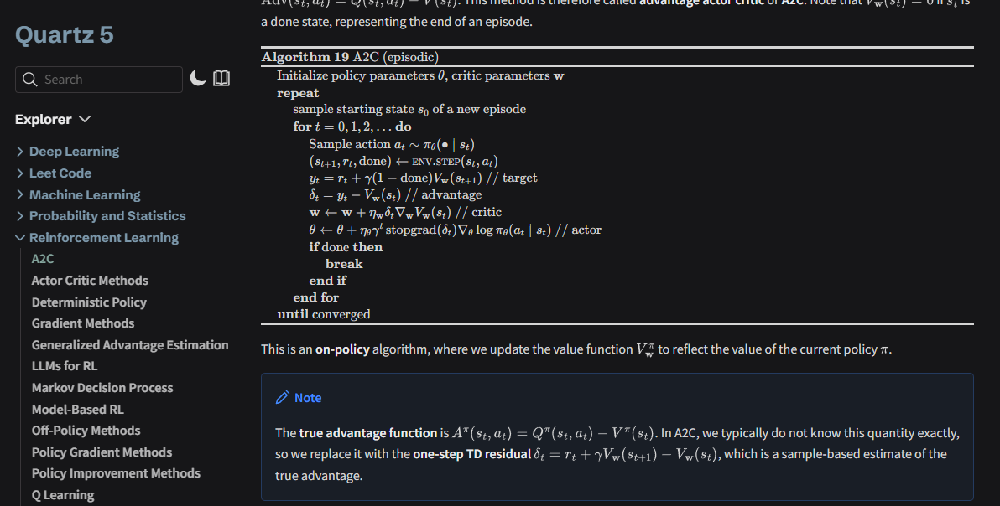

# Pseudocode

Quartz v5 transformer plugin that renders `pseudo` and `pseudocode` code blocks using the `pseudocode` library.

> [!NOTE]
> This matches the Obsidian community plugin [Obsidian-Pseudocode](https://github.com/ytliu74/obsidian-pseudocode), so pseudocode blocks should just work as-is.

## Demo

For the following codeblock in your notes, it does the following:
````
```pseudo
\begin{algorithm}
\caption{A2C (episodic)}
\begin{algorithmic}
\State Initialize policy parameters $\mathbf{\theta}$, critic parameters $\mathbf{w}$
\Repeat
    \State sample starting state $s_0$ of a new episode
    \For{$t=0,1,2,\dots$}
        \State Sample action $a_t \sim \pi_{\mathbf{\theta}}(\bullet \mid s_t)$
        \State $(s_{t+1}, r_t, \mathrm{done}) \gets$ \Call{env.step}{$s_t, a_t$}
        \State $y_t = r_t + \gamma (1 - \mathrm{done}) V_{\mathbf{w}}(s_{t+1})$ \Comment{target}
        \State $\delta_t = y_t - V_{\mathbf{w}}(s_t)$ \Comment{advantage}
        \State $\mathbf{w} \gets \mathbf{w} + \eta_\mathbf{w} \delta_t \nabla_{\mathbf{w}} V_{\mathbf{w}} (s_t)$ \Comment{critic}
        \State $\mathbf{\theta} \gets \mathbf{\theta} + \eta_{\mathbf{\theta}} \gamma^t \, \mathrm{stopgrad}(\delta_t) \nabla_{\mathbf{\theta}} \log \pi_{\mathbf{\theta}} (a_t \mid s_t)$ \Comment{actor}
        \If{$\mathrm{done}$}
            \Break
        \EndIf
    \EndFor
\Until{converged}
\end{algorithmic}
\end{algorithm}
```
````



## Install

```bash
npx quartz plugin add github:tuero/pseudocode-component
```

## Usage

Add it to `quartz.config.yaml`:

```yaml
plugins:
  - source: github:tuero/pseudocode-component
    enabled: true
    options:
      lineNumber: true
      noEnd: false
```

## Options

| Option | Type |
| --- | --- |
| `lineNumber` | `boolean` |
| `lineNumberPunc` | `string` |
| `noEnd` | `boolean` |
| `scopeLines` | `boolean` |
| `indentSize` | `string` |
| `commentDelimiter` | `string` |
| `captionCount` | `number` |
| `titlePrefix` | `string` |

The plugin also injects the upstream pseudocode stylesheet plus a small border-color override so rendered algorithms inherit the current Quartz theme colors correctly.
